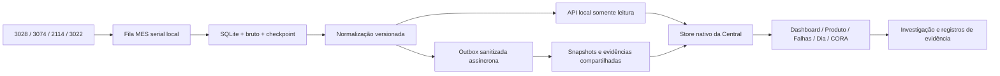

# Auditoria arquitetural — Central de Trabalho V2

Data: 2026-10-08. Fonte de verdade: GitHub, Issue #21, PR draft #22, branch `v2/native-fusion`.
Baseline auditada: `8cbd5fee9558e5e60e312faea583a85435915dda` (base main `fb5dda364557b0ae11639d68261b61ad44cff7ac`).
Status: **auditoria de código concluída; migração proposta; V2/V0.5.23/3022 NÃO GREEN**.

## Conclusão executiva

A direção canônica está correta: uma Central, com A-MES como fonte de evidência operacional. A implementação atual ainda é uma prova de integração. O produto oficial não importa os dados MES; o preview adiciona outra navegação, outro estado e outra instância Firebase. Copiar os cards do preview para a Central conservaria os problemas de identidade, completude e autoridade dos dados.

A prioridade é fechar o contrato de evidência e o acesso nativo, depois migrar cada view. Não é necessário reescrever a Central nem alterar os coletores validados. O primeiro corte seguro é um núcleo puro, testável e de leitura, ligado ao estado/autenticação existentes, que reconheça os snapshots legados como **parciais**. Publicação cloud, transformação de dados reais 3074/2114 e mudanças de permissões precisam de gates específicos antes de ativação.

## Método e limites da evidência

Lidos integralmente: V2_ARQUITETURA_CANONICA, V2_WORK_CODEX_MISSION, HANDOFF_MESTRE, ESTADO_ATUAL, DECISOES_ARQUITETURAIS, V2_INTEGRACAO_PLANO, release latest e manifestos versionados. Inspecionados os caminhos ativos de estado/auth/render, Dashboard, Produto, Falhas/radar, turno, CORA, CSS/mobile, SW, protótipos e Quality Gate. Referências de linha abaixo pertencem à baseline auditada.

O gate local passou em 54 verificações estáticas. O CI desse SHA também passou: [run 37854509802](https://github.com/pedrokam700/Central-de-Controle-/actions/runs/37854509802). Isso não testa a fábrica nem a segurança das regras em execução.

Não houve login na aplicação, leitura de dados industriais reais, teste de dispositivo mobile, acesso ao notebook da fábrica, implantação Firebase nem execução do ZIP. O repositório contém índices/hashes dos pacotes, mas não os fontes Python/SQLite/batch nem o backend `/api/*` da CORA. Portanto, serialização MES, persistência antes do refresh, sanitização do agente, CORS efetivo e instalação são requisitos/documentação, não verificações independentes desta auditoria. Não se presume que as regras versionadas estejam implantadas.

## Achados priorizados

| ID | Prioridade | Evidência na baseline | Impacto / decisão |
|---|---|---|---|
| A01 | P1 | `index.html:3674` carrega somente app.js; `v2/index.html:13`; `v2/proxy/server.mjs:6,45` | Preview depende de iframe ou proxy que injeta native.js e usa upstream Vercel fixo. A Central GitHub não consome a integração. Migrar para imports nativos; aposentar entradas antigas só após paridade verificável. |
| A02 | P1 | `v2/native.js` cleanInsights/readLocal/defectTable | Limite 160 na coleta da ponte, 100 na exibição e drilldowns reduzidos a contagens; v2.js exibe 80. KPI pode representar universo maior que os registros compartilhados. Marcar parcial; nunca reconstruir FPY ou reuso desses recortes. |
| A03 | P1 | `v2/native.js` clean/readLocal | Sem occurrence_id estável, referências brutas, escopo temporal, origem por campo ou versão de normalizador. Não há prova de que summary, defects e insights pertencem ao mesmo snapshot quando a coleta muda entre requests. Exigir envelope coerente e IDs de origem. |
| A04 | P1 | `firestore.rules:57-86` | Usuário ativo pode criar/alterar/apagar dados e aiKnowledge, inclusive snapshots com status validado_sistema. Sanitização no browser não é autorização. Separar papel coletor/leitor, linhas autorizadas, campos e trilha imutável; testar regras em emulador. |
| A05 | P1 | `firestore.rules:24-35`; `app.js:360-389,1421` | Bootstrap admin confia no email sem email_verified. Cadastro cria usuário ativo sem aprovação corporativa nas regras. Risco condicionado ao provedor e às configurações Auth: não é prova de tomada de conta existente. Rever admissão e bootstrap com teste de conta nova, sem bloquear usuários válidos inadvertidamente. |
| A06 | P1 | `v2/native.js` sync/signature/src | Um documento mutável por linha, último escritor vence, sem revisão/ordem, checkpoint/outbox ou fencing entre postos. Assinatura só usa IDs/contagens; correções sem mudança de contagem podem não ser enviadas. Snapshot antigo local sempre vence remoto, e falha Firebase muda estado do agente para ausente. Separar saúde local, freshness e publicação. |
| A07 | P1 | `v2/native.js` readLocal/cleanInsights | summary e arrays de KPIs são repassados sem allowlist recursiva; limpar defects não prova que todo payload está sanitizado. Campos novos do agente poderiam passar para cloud. Projetar campos permitidos, tipos/tamanhos e rejeitar schemas desconhecidos. |
| A08 | P1 | `v2/native.js` boot/renderAll | MutationObserver observa body e chama renderAll, que escreve innerHTML nos descendentes observados. Risco direto de ciclo de mutações/render, especialmente após abrir overlay/cards; detect lê local e sync relê tudo. Substituir por eventos do store, render seletivo e request único. |
| A09 | P1 | `v2/native.js` embedProduct/key | Correspondência por prefixo mistura variantes CPH; modelo vazio passa por startsWith(''). Identidade é extraída do título do DOM. Usar ID/chave do produto selecionado; família/base apenas por relação configurada. |
| A10 | P1 | `app.js:3352-3381` | CORA recebe apenas text/status/type de aiKnowledge, sem payload estruturado nem referências resolvíveis. validado_sistema é confundível com conclusão validada. Introduzir contexto tipado, cobertura e citações por registro; jamais promover correlação a causa. |
| A11 | P1 | `v2/native.js` onSnapshot/onAuthStateChanged; `app.js:1507-1523` | Protótipo assina toda aiKnowledge fora do ciclo de login; mapas remotos não removem documentos apagados nem são limpos no logout. Na Central, logout limpa somente parte de state; memória, conversas e dados do turno permanecem em RAM. Limpar todo estado de sessão, cancelar respostas tardias e listeners. |
| A12 | P1 | `app.js` chamadas `/api/failure-analysis`, `/api/chat-cognitive`, `/api/ai-memory`, etc. | Backend não versionado aqui. GitHub como fonte de verdade não demonstra que essas APIs existirão no host estático. Inventariar origem, contrato, auth e responsável por cada API; preview não pode ocultar dependências da operação oficial. |
| A13 | P2 | `app.js:436-514,5735-5761` | Listeners de coleções inteiras e render de todas as views a cada alteração. Aproximadamente 615 KB de app.js; crescer MES nesse padrão aumenta custo/re-render e memória. Reusar autenticação, buscar sob demanda, paginar e indexar consultas por escopo. |
| A14 | P2 | `app.js:2248` e `index.html` Dashboard | Dashboard mede reports manuais; rótulo Total de Falhas pode parecer contagem MES. Manter universos explicitamente distintos (ocorrências, unidades, reports, ações). Não somar reports relacionados às ocorrências como novas falhas. |
| A15 | P2 | `app.js:1819-1880,2060`; protótipos | Produto mostra reports/histórico de updates; Falhas não recebe entidades MES; rastreabilidade compartilhada inexistente no shell. Integrar no conteúdo atual, sem aba A-MES genérica nem cópias de ocorrência. |
| A16 | P2 | `app.js:1943-2029,4790-4822` | Radar aproxima registros por descrição/componente/família e aceita contexto entre linhas. É hipótese para casos manuais, não denominador operacional MES. Filtro diário por produto pode incluir outra linha. Mapear scopeId → line_id e recortar turno; nunca reutilizar o radar como calculadora de KPIs de linha. |
| A17 | P2 | `v2/v2.js` PACKAGE_URL; latest/release.json | Download hard-coded no protótipo difere do ID latest; não há escolha persistida por computador, verificação de compatibilidade ou consumo do manifesto na Central. Manifesto diz minimum 2.0.0, runtime atual é 15.1.13.40: são eixos diferentes, comparação numérica isolada é inadequada. |
| A18 | P2 | `index.html:27-2847,3676-4185`; `styles.css`; `mobile.css` | 15 blocos style em cascata, overrides após body, styles.css não ligado diretamente mas precacheado; muitos !important e overflow-x:hidden. Há dívida de estilos, não duplicação de todo app.js inline ativo. Extrair CSS por etapas após comparação visual; não religar styles.css indiscriminadamente. |
| A19 | P2 | `sw.js:1-6`; `index.html:11-25`; `app.js:2832,7268` | SW usa base fixa e cai em index.html também para assets/JSON ausentes; manifesto pode receber HTML offline. Instalador engole erro do precache; build guard limpa todos os caches/SWs da origem, e há listeners duplicados de atualização. Restringir escopo e fallback por tipo; versionar novos módulos junto do shell. |
| A20 | P2 | `scripts/quality-gate.mjs`; `.github/workflows/quality-gate.yml` | Gate confere sintaxe, strings/IDs e presença de regras; não comprova semântica, segurança, mobile, drilldown ou offline. Console GREEN é apenas estático. Adicionar testes reais de contratos e rotular o alcance do resultado. |
| A21 | P2 | HANDOFF/ESTADO_ATUAL/V2_* markers/release README | Handoff atual sugere Vercel e markers citam outra branch; conflita com Issue #21. Preservar histórico, apontar continuidade para arquitetura canônica e auditoria, atualizar estado sem alterar baseline validada. |
| A22 | P2 | árvore raiz + SOURCE_HASHES.txt v0.5.22 | Backups HTML grandes publicados junto do produto; não há build reproduzível do pacote 0.5.23 neste repo. Arquivar após identificar dependências; exigir origem revisável do agente e validação do ZIP/hash, migração e rollback antes de trocar pacote. |

### Achado adicional após revisão do corte seguro

**A23 — P1: fila offline compartilhada entre contas, sem idempotência.** Na baseline `app.js:2824-2827`, queueOfflineWrite não guarda UID proprietário, e syncOfflineQueue usa addDoc sob a conta atual. Uma gravação confirmada seguida de falha antes da remoção pode duplicar o documento; chamadas concorrentes também. O fallback conserva apenas os últimos 50 itens e o toast informa sucesso mesmo após interrupção. A limpeza de state em RAM não corrige IndexedDB/localStorage. Recomenda-se outbox por UID, IDs determinísticos, exclusão apenas após ack, trava de replay e migração que preserve pendências legadas sem atribuir autor por suposição. Não alterar essa fila sem teste de migração de dados existentes.

## Arquitetura recomendada



O caminho de render local é SQLite → normalização → store, sem aguardar Firebase. A sequência do documento canônico que coloca publicação antes de renderizar deve ser entendida como ordenação de persistência/derivação, **não barreira síncrona de cloud**, em respeito às decisões 1, 22 e 31.

Estrutura sugerida: `ames/data/` para contrato, normalizadores, store, seletores e adaptadores; views continuam no shell atual até extração gradual. Um Firebase app/Auth e um dono dos listeners. Rastreabilidade é uma consulta/painel reutilizável com rota de investigação, não um segundo aplicativo. Evitar tanto framework novo sem necessidade quanto novo monólito ames.js com DOM + rede + negócio.

### Modelo comum aos quatro conjuntos de evidência

Todas as entidades devem conter origem e identidade: `schema_version`, `normalizer_version`, `source_view`, `line_id`, `snapshot_id`, `source_record_id`, `collected_at`, instante do evento, timezone de origem, `product_key`, `raw_ref` local e referência sanitizada remota. Usar nullable/unknown para ausências; não converter desconhecido em zero. Tempo de coleta, do evento e da sincronização são três coisas diferentes.

| Entidade | Identidade e responsabilidade |
|---|---|
| LineSnapshot | Linha + snapshot + revisão; escopo de consulta/turno/período/modelo e cobertura por dataset. Snapshot novo não apaga anterior. |
| FailureOccurrence (3028) | ID imutável da fonte quando disponível, linha, PCBA, defeito, Defect Time e reparo. Mesmo registro em snapshots diferentes não vira nova ocorrência histórica. Sem ID real, usar referência temporária limitada ao snapshot, nunca afirmar deduplicação global. |
| PCBAHistory (2114) | Histórico completo da PCBA, eventos/IDs e índice de uso **da PCBA** quando comprovado. Ausência de histórico coletado não equivale a placa nova. |
| MaterialTrace (3074) | Material SN, tipo, intervalos bind/unbind, PCBAs atuais/anteriores e evidências. Índice de uso por ciclos/associações; Batch Count não é reuso. Material code não identifica unidade física. |
| ProcessTimeline (3022) | Eventos com PCBA/product SN, linha, processo, posto, instante/resultados válidos. Aplicar max(event_time <= defect_time) dentro da identidade e contexto corretos. Empates precisam de sequência confiável ou indicação de ambiguidade. |
| CorrelationEvidence | Relaciona ocorrência a evidência, regra/versão/explicação. Estado evidence/hypothesis; confirmed somente com validação humana auditável e permissão. |
| CaseEvidenceLink | Relação reversível caso manual ↔ ocorrência(s), autor/data/motivo/versão. Origem ambos é derivada do vínculo, sem transformar ambos em um registro destrutivo. |
| MetricEvidence | Nome, valor/unidade, numerador, denominador, filtros, versão da regra, snapshot, conjunto de IDs ou consulta imutável e cobertura. |

Reuso PCBA e material têm universos e drilldowns diferentes. Uma PCBA com vários componentes reutilizados não pode multiplicar o contador de PCBAs. Recorrência por mesmo código difere de mesma família, cuja taxonomia precisa ser versionada. Comparação entre linhas pode colocar séries lado a lado; não gerar FPY combinado silenciosamente.

FPY/Check FPY/Quantity devem preservar definição/denominador da fonte. A lista de defeitos 3028 não prova o universo de unidades aprovadas. Quando só houver agregado, mostrar origem/escopo e **evidência detalhada indisponível**; não oferecer lista parcial como se explicasse a taxa inteira.

### Contrato de consulta e sincronização

- Seletores exigem linha explícita; filtros incluem produto exato, turno, período, defeito e categoria de reuso. Comparação multi-linha retorna partições, não soma implícita.
- Envelope por dataset: `availability` (available/partial/unavailable/not_collected/error), `row_count`, `total_count` quando conhecido, paginação, snapshot/revisão e razões de incompletude.
- Não colar summary de um snapshot com defects de outro. API de export deve fixar snapshot/revisão em todas as páginas. Enquanto o agente não comprovar esse contrato, cliente legado é parcial.
- Store separa disponibilidade local, falha de publicação, origem escolhida e idade do dado. Origem local tem preferência operacional enquanto conectada; informar local stale, sem substituir silenciosamente por dado cloud de outro escopo. Remoto é sempre último sincronizado, nunca tempo real declarado.
- Snapshot/ocorrências compartilhadas: manifesto pequeno por linha, versões imutáveis e páginas de evidências; trocar ponteiro latest somente após publicação completa. Não colocar toda a fábrica em um documento nem manter só contagens.
- Outbox local com idempotência, hash do conteúdo permitido, versão, tentativas/backoff, ack e retomada após queda. Eleição/registro de coletor por linha ou revisão monotônica resolve múltiplos postos. Sobrescrita por relógio do navegador não resolve ordenação.
- Firebase indisponível não altera health do agente nem apaga SQLite. Leitura remota não dispara consulta MES. Bridge oferece dados já persistidos, sem cookies/sessão/CDP/comandos remotos.
- Migração: ler `aiKnowledge` legado através de adaptador; nova coleção tipada só após contrato e regras aprovados/testados. CORA pode indexar referências dessa mesma base, sem duplicar fonte operacional em memória textual.
- Sanitização por projeção recursiva de campos permitidos; bruto fica local. Evidência remota sanitizada mantém IDs, contexto e cobertura. Políticas de retenção, acesso a SN e operador devem ser explícitas.

### Experiência unificada por view

| Área | Mudança recomendada e aceite |
|---|---|
| Início | Trabalho do usuário e linhas alocadas, com idade do snapshot e alerta acionável; links abrem o mesmo filtro na investigação. Não criar Home MES. |
| Dashboard | Barra única de escopo; operação, Pareto, reuso PCBA/material, recorrência e ações no mesmo fluxo. Reports continuam como ações, identificados separadamente. Cada métrica abre seu conjunto exato ou declara a lacuna. |
| Produto/CPH | Usar produto do estado, relação família/base configurada e linha em foco. Visão Geral combina cadastro/operação/ações; Falhas combina casos e ocorrências sem duplicar; Histórico reúne eventos e vínculos. |
| Falhas | Lista de casos e ocorrências com origem, progresso de investigação e referências; sugestão por linha + CPH + defeito + janela, confirmada/rejeitada com histórico. Repair status MES não fecha automaticamente ação humana. |
| Rastreabilidade | Entrada PCBA/material/ocorrência/linha/CPH e timeline com proveniência. Abrir a partir de qualquer KPI; voltar preserva filtro/scroll. Dados ausentes de 2114/3074/3022 são explicitados. |
| Central do Dia | scopeId mapeado a line_id, janela de turno inclusive virada de dia, responsável e CPH vigente. Congelar referências dos snapshots na passagem de turno; dado recente não reescreve turno antigo. |
| CORA | Recuperação estruturada e limitada ao escopo, com referências acessíveis. Distinguir fato da fonte, correlação calculada, hipótese e validação humana. Testar perguntas sobre contagem, reuso e processo posterior à falha. Backend deve aplicar autorização; instrução de prompt não a substitui. |
| Perfil / Integração | Diagnóstico e instalação discretos. Depois do login: health local; conectado não incomoda; ausente oferece configurar/somente visualizar e persiste decisão neste computador. Revogar escolha pelo perfil. |

Navegação proposta: Início, Central do Dia, Dashboard, Produtos, Falhas, Atividades/Fluxos, CORA, Perfil. Rastreabilidade é investigação acessível por busca e links contextuais; não precisa repetir o menu inteiro. Unificar detalhes de evidência, chips de origem/freshness, seleção de escopo e ações relacionadas entre views. Não unificar à força report de fornecedor, ocorrência física e tarefa: seus ciclos de vida são distintos.

Mobile: filtros recolhíveis, escopo sempre visível, cartões clicáveis com nome acessível, área de toque suficiente, foco/voltar preservados, lista paginada em vez de tabela enorme. Testar 360/390/768 px, teclado, zoom 200%, rotação e overflow real; overflow-x:hidden não é evidência de ausência de corte.

### Pacote e onboarding

Ler `ames/releases/latest/release.json` com timeout e validação de schema, URL HTTPS, versão e SHA-256. Mostrar candidata e baseline separadamente. Ausência do manifesto não impede consulta remota. Não abrir download nem instalar automaticamente; download acontece pela escolha do usuário. Verificar hash do ZIP recebido no fluxo do posto antes de executá-lo; simples exibição do hash não é verificação.

Antes de promover pacote: obter fontes canônicos da V0.5.23, verificar hash/tamanho contra GitHub, dependências/requisitos Windows, detecção de porta ocupada por outro processo, inicialização idempotente, logs sem segredo, diagnóstico de rede/CORS na origem oficial, backup/migração controlada e rollback. Confirmar contrato de health/version/capabilities com o agente real. Nunca inferir 3022 disponível porque a porta está aberta.

### Permissões e fronteiras

Matriz recomendada: leitor consulta linhas autorizadas; coletor publica somente suas linhas e evidências permitidas; investigador vincula casos e hipóteses; validador confirma conclusões; admin gerencia escopos/usuários. Implementar apenas os papéis necessários, com regra executada no backend, sem confiar em clientRole ou botões ocultos. Preservar colaboração onde é intencional; alteração de registros alheios deve ter política e auditoria explícitas.

```json
{
  "score": 2,
  "summary": "Regras versionadas inadequadas para evidência operacional confiável; ambiente implantado não verificado.",
  "findings": [
    {"check":"Authority Source / Admin bootstrap","severity":"major","issue":"Email admin sem email_verified e auto-admissão de usuário ativo.","recommendation":"Definir admissão e bootstrap verificados com testes Auth/Rules."},
    {"check":"Identity-Level Security","severity":"major","issue":"Qualquer usuário ativo altera ou apaga snapshots e status validado_sistema em aiKnowledge.","recommendation":"Separar publicação, escopo de linha e confirmação humana; trilha imutável."},
    {"check":"Update Bypass / Type Safety","severity":"major","issue":"Dados de negócio sem campos imutáveis, schema ou tipos nas regras de create/update.","recommendation":"Validar ambos os caminhos, hasOnly/diff, tipos e autor autorizado."},
    {"check":"Resource Exhaustion/DoS","severity":"minor","issue":"Sem limites funcionais de strings/arrays e payloads; limites gerais do Firestore não garantem integridade.","recommendation":"Limitar schema, bytes, paginação e cadência de publicação."},
    {"check":"Business Logic vs Rules","severity":"major","issue":"Coleta confiável, leitores e confirmação de evidência compartilham a mesma permissão genérica.","recommendation":"Testar matriz de papéis, desativação, logout e escrita entre linhas no emulador."}
  ]
}
```

Referências oficiais consultadas: [validação de campos](https://firebase.google.com/docs/firestore/security/rules-fields), [limites Firestore](https://firebase.google.com/docs/firestore/quotas), [testes de regras](https://firebase.google.com/docs/rules/unit-tests). Firestore limita documento a 1 MiB: aumentar o limite de 160 mantendo um único documento não é solução de escala.

## Plano recomendado em fases verificáveis

| Fase | Entrega | Gate / próximo passo seguro |
|---|---|---|
| 0 — auditoria | Este relatório + conflitos na Issue/PR, estado atualizado e baseline registrada. | Commit documental antes de código. Não alterar main, pacote ou regras publicadas. |
| 1 — fundação | Contrato/store de leitura; adaptador legado conservador; identidade CPH exata; estados de cobertura/origem; seleção temporal 3022; integração no estado/auth existentes. | Testes negativos de linha/schema/ID/tempo; logout limpa tudo; gate atual continua passando. Este é o corte seguro desta auditoria. |
| 2 — bridge e publicação | Obter contrato real do agente; export coerente/paginado; outbox, sanitização, regras/índices, papéis e migração cloud. | Emulador com usuários adversários; timeout/cloud down não afeta SQLite; concorrência de postos, retry, revisão e evidência completa. Sem ativar upload genérico antes desse gate. |
| 3 — onboarding | Manifesto validado, escolha por computador, perfil/diagnóstico, versão/capacidade real e pacote verificável. | Remoto sem instalação; convite não reaparece; manifesto inválido/offline tem fallback seguro; pacote/hash/migração validados. |
| 4 — Dashboard + Produto | Consumidores nativos do mesmo store, filtros e detalhes de evidência. | Conjunto de IDs de cada KPI confere, variantes CPH não se misturam; amostra nunca representa total; paridade manual preservada. |
| 5 — Falhas + Rastreabilidade | Entidades e links reversíveis, timeline única e busca reutilizável. | Reuso PCBA/material separados; mesmo defeito/família distinguíveis; hipótese não fecha caso nem confirma causa. |
| 6 — Dia + CORA | Contexto de linha/turno, passagem congelada e recuperação estruturada com citações. | Virada de turno, família configurada, dado atrasado e pergunta sem evidência; autorização também no backend. |
| 7 — 3022 + retirada do paralelo | Adaptador real conforme contrato, evento anterior, agrupamento processo/posto; aposentar iframe/overlay/proxy após paridade. | Dataset real de fábrica com evento posterior e empates; nenhuma função principal depende do preview; rotas antigas têm destino claro. |
| 8 — aceite | CI no SHA candidato, E2E e ensaio fábrica → Firebase → remoto/offline; pacote e app rastreáveis. | Evidência real anexada com linha/turno/snapshot/versões; só então revisão de promoção. Não fazer merge nesta missão. |

Reversibilidade: cada fase em commit/PR checkpoint pequeno, feature só ativada após gate, readers legados durante migração; não apagar dados ou fontes antigas por conveniência. Reverter o consumidor mantém a coleta/SQLite intacta.

## Matriz mínima de validação

1. Mesmo SN em linhas distintas; SN em branco; variantes CPH; família não configurada; zero vs desconhecido; snapshot parcial e IDs duplicados.
2. KPI → IDs → evidência da mesma revisão, sem trocar ao chegar nova coleta; contagem de unidades vs ocorrências; denominador conhecido.
3. 3022 antes/igual/depois do Defect Time, timezone explícito, horário inválido, evento de outra PCBA/linha e empate ambíguo. Nenhum dado mock vira dado operacional.
4. Agente ausente, health inválido, export falha, troca de snapshot durante leitura, cloud indisponível, remoto vazio e deleção/revogação. Nunca disparar comando MES pelo cliente compartilhado.
5. Logout/troca de usuário/resposta tardia; escrita por leitor, linha alheia, schema inesperado e tentativa de confirmar hipótese; emulador de regras antes de deploy.
6. Login e CRUD atuais de reports/falhas/atividades; navegação/retorno/filtro; mobile/teclado/zoom; offline com assets versionados e manifesto sem cache enganoso.
7. Medir payload, leituras Firebase, render count e latência p50/p95 com dados anonimizados de escala conhecida; orçamento após baseline medido, sem afirmar ganho sem medição.
8. Fábrica: registrar SHA app, hash do ZIP, linha, turno, snapshot, timestamp e resultado de cada cenário. V0.5.20 permanece baseline documentada; CI verde sozinho nunca promove V2/V0.5.23/3022.

## Decisões e pendências para o executor

A arquitetura da Issue #21 prevalece sobre markers de preview. O corte 1 pode avançar sem tocar no motor MES. Não afirmar implementação de 3074/2114 ou coletor 3022 sem os fontes/dados reais; não desenhar paginação de endpoint desconhecido. Não ampliar upload no navegador enquanto autoridade/sanitização/coerência não forem garantidas. Antes de migração visual ampla, capturar baseline autenticada e executar smoke mobile/desktop. Este relatório recomenda arquitetura; não representa aprovação humana de detalhes de papéis/retensão nem aceite de fábrica.
